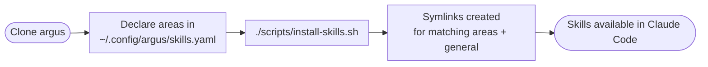

# Skills Handbook

Companion to the [engineering handbook](./engineering-handbook.md). Covers how engineering-org Claude Code skills are authored, reviewed, distributed, and discovered. The skills *themselves* — what each one does and when to run it — are documented in their own SKILL.md files and surfaced in the index at `argus/skills/README.md`.

---

## Section 1: Quick reference

| Concern | Location |
|---|---|
| Single-file skill | `argus/skills/[skill-name].md` |
| Bundled skill (with scripts, assets, or MCP server) | `argus/skills/[skill-name]/SKILL.md` |
| Generated index of all skills | `argus/skills/README.md` |
| Engineer's local install | `~/.claude/skills/` (symlinks into a local argus checkout) |
| Engineer's opt-in config | `~/.config/argus/skills.yaml` |
| Install / sync script | `argus/scripts/install-skills.sh` *(not yet built — see gaps)* |

**Scope:** This folder is for skills used across the engineering org. Personal or experimental skills stay in an engineer's local `~/.claude/skills/` until they're worth sharing through the review process here.

---

## Section 2: The process

### Authoring workflow


Steps:

- **Clone argus + install** — one-time setup. Clone to a durable location (e.g. `~/code/argus`) and run the install script. This symlinks `argus/skills/` files into `~/.claude/skills/` so Claude Code loads them live from your checkout.
- **Feature branch** — `git checkout -b feature/skill-[name]` in argus.
- **Write the skill** — `argus/skills/[name].md` (single-file) or `argus/skills/[name]/SKILL.md` (bundled). Set `status: draft` in frontmatter while iterating.
- **Iterate via symlink** — every save is immediately testable in Claude Code; no copy step. The skill lives in argus from the moment it's drafted.
- **Flip to `status: active`** — push, open PR, follow the [documentation PR workflow](./engineering-handbook.md#documentation-pr-workflow) with two differences (see *Review* below).
- **Released** — merge to `main` makes the skill available to anyone in matching areas on their next sync.

### Naming

- Filenames must be unique within `skills/`.
- Choose names that read well as slash commands: `bh-ticket-start`, not `start`.
- Filename slug = the `name:` field in frontmatter.

### Frontmatter contract

Skills extend Claude Code's required `name:` and `description:` with argus metadata used for indexing, review routing, and opt-in filtering:

```yaml
---
name: bh-ticket-start         # required by Claude Code
description: ...              # required by Claude Code; Claude uses it to decide when to invoke
area: billflow                # area slug, or [billflow, infra] for multi-area, or "general"
owner: @david.edwards         # github handle or team responsible for the skill
last_reviewed: 2026-05-20
status: active                # active | draft | deprecated
---
```

`area:` values must match a slug in [`areas/README.md`](../areas/README.md), or be `general`. The taxonomy is shared with TDDs and ADRs.

### Review

Skills go through the same [documentation PR workflow](./engineering-handbook.md#documentation-pr-workflow) as TDDs and ADRs, with two differences:

- **One approver is sufficient.** Lightweight bar — skills are reversible and scoped.
- **PR author @-mentions the `owner:` from frontmatter** to route review. CODEOWNERS cannot pattern-match on frontmatter, so this is norm-enforced.

### Consumer workflow



Steps:

- **Clone argus** to a durable location (e.g. `~/code/argus`).
- **Declare your areas** in `~/.config/argus/skills.yaml`:

  ```yaml
  areas:
    - billflow
    - infra
  ```

- **Run the install script.** It reads each skill's `area:` frontmatter, symlinks the ones matching your declared areas plus all `area: general` skills into `~/.claude/skills/`. Skills outside your areas are skipped. Default with no config file: only `general` skills install.
- **Update by pulling.** `git pull` in argus + re-run install script picks up new and removed skills. A `bh-skills-update` alias wraps both: `(cd ~/code/argus && git pull && ./scripts/install-skills.sh)`.

### Joining a new area

Edit `~/.config/argus/skills.yaml`, add the area, re-run the install script:

```
$ bh-skills-update
+ symlinked: bh-claim-lookup
+ symlinked: bh-eligibility-check
- pruned: stale-skill-removed-from-argus
```

### Discovery

The full catalog is browsable in `argus/skills/README.md`, regardless of which skills you have installed locally. Discovery is deliberately decoupled from installation: you see what exists across the org, opt in to what you'll use.

The index is generated from skill frontmatter (grouped by `area:`, listing `name`, `description`, `owner`, `last_reviewed`, `status`). It is not hand-edited.

---

## Section 3: Rationale

### Why flat `skills/`, not per-area like TDDs and ADRs

Skills are executable artifacts that Claude Code loads from a flat directory (`~/.claude/skills/`). Mirroring that layout in argus keeps the install script simple — symlink files one-to-one, no tree traversal logic, no decisions about where multi-area skills go.

Skills are also browsed differently than TDDs and ADRs. A TDD is a point-in-time record for one feature; you reach it by name. A skill is a tool you reach for from inside an unrelated task; you browse the list looking for one that fits. A flat folder with a frontmatter-driven index serves that browsing pattern.

Area ownership is preserved in the `area:` and `owner:` frontmatter fields, and the generated index groups skills by area when rendered — so the area-first mental frame still works for discovery.

### Why symlinks, not copies

Author and consumer use the same mechanism: a symlink from `~/.claude/skills/` into a local argus checkout. This collapses two drift problems into one:

- **Author drift** — without symlinks, an author would develop in `~/.claude/skills/foo.md` and PR a *copy* to argus. After merge there would be two files on disk, free to diverge. Symlinking the argus checkout means there is only ever one file. The skill lives in argus from the moment it is drafted.
- **Consumer drift** — copies require a sync step that's easy to forget. Symlinks plus `git pull` is the same mechanism every monorepo uses; drift collapses into "did you pull lately?"

### Why opt-in by area, not install everything

Claude Code uses every available skill's `description:` to decide when to invoke it. Loading the entire org's catalog has real costs:

- **Misfire risk** — a BillFlow-specific skill might get invoked when a non-billing engineer mentions a "claim" in unrelated context. More skills available = more chances for the wrong tool to surface.
- **Access errors** — skills that assume system access (internal APIs, credentials, specific repos) produce confusing failures for engineers without that access.
- **Token cost** — skill descriptions get loaded into every Claude Code session's context.

Opt-in by area scopes each engineer's catalog to skills they're likely to actually use. Cross-area engineers (platform, on-call rotations, T-shaped roles) list multiple areas in their config; no special handling needed.

### Why the index is browsable even for skills you don't have installed

Opt-in only works if engineers can still see what exists. Without a browsable index, opt-in becomes "you can't find what you don't have" — which silently recreates the original problem (engineers re-solve problems other areas have already automated). The index decouples *seeing* from *installing*: see the full catalog, install the slice that's relevant.

---

## Section 4: Known gaps

### Skills index generator — not yet built

`argus/skills/README.md` should be auto-generated from each skill's frontmatter, grouping by `area:` and listing `name`, `description`, `owner`, `last_reviewed`, `status`. Until built, the file is hand-maintained and will drift.

### Install / sync script — not yet built

`scripts/install-skills.sh` should: read each skill's frontmatter, filter by `~/.config/argus/skills.yaml` declared areas, symlink matching skills + all `area: general` skills into `~/.claude/skills/`, and prune dangling symlinks whose targets no longer exist (renames, removals). Until built, engineers manage skills manually.

### Integration with `/gstack-upgrade` — not yet decided

`/gstack-upgrade` already keeps gstack itself current. Folding `(cd ~/code/argus && git pull && ./scripts/install-skills.sh)` into the same flow would mean one command keeps both tools and skills updated. Worth doing once the install script exists.

### Deprecated-skill warnings — no mechanism

A skill with `status: deprecated` is still installed and still available to Claude Code. No tooling currently warns the user or surfaces "use X instead." Acceptable as a known gap until enough deprecations exist to justify the work.

### Bootstrapping the first round of skills

The skills currently in use across the org (referenced throughout the engineering handbook — `/plan-eng-review`, `/codex`, `/review`, `/cso`, etc.) need to be moved into `argus/skills/`, given frontmatter, and assigned owners. Per-skill PRs; can parallelize. Until done, references to those skills in the engineering handbook point at tooling that lives elsewhere.
